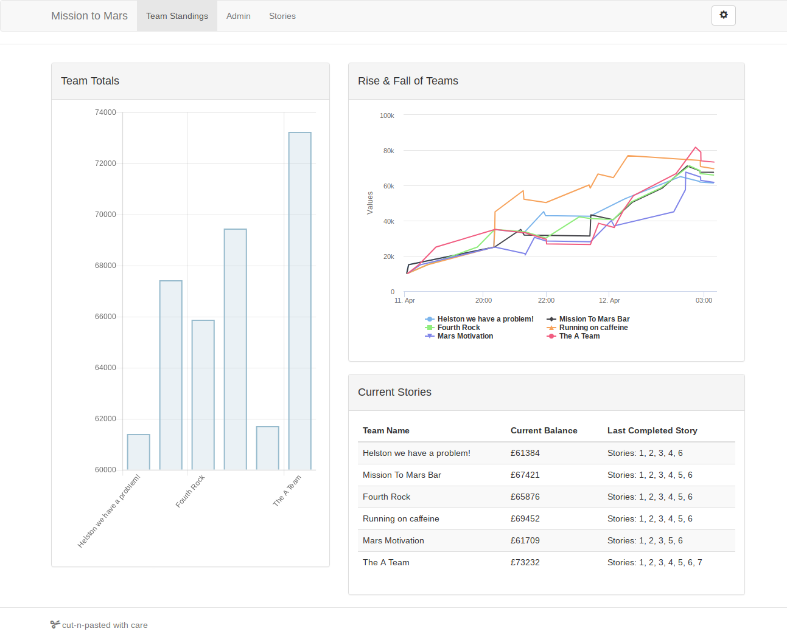

# Missio to Mars: Apprentices - July 2019

Code created at the iamdigital Mission to Mars in July 2019, hosted at the Cornwall College
campus in Pool. Students were given the support of a team of mentors from local education
and businesses and tasked to complete the provided manoeuvrability challenges.

## Results
The challenges come with a Core Coin reward, with the prizes being totted up via
the teams dashboard.

The results were:

1. The A-Team                    - $73,232
2. Running on caffeine          - $69,452
3. Mission to Mars Bar          - $67,421
4. Fourth Rock                  - $65,876
5. Mars Motivation              - $ 61,709
6. Helston, we have a problem   - $61,384

## Usage Instructions
Clone the project locally and check out the various .ino files.
